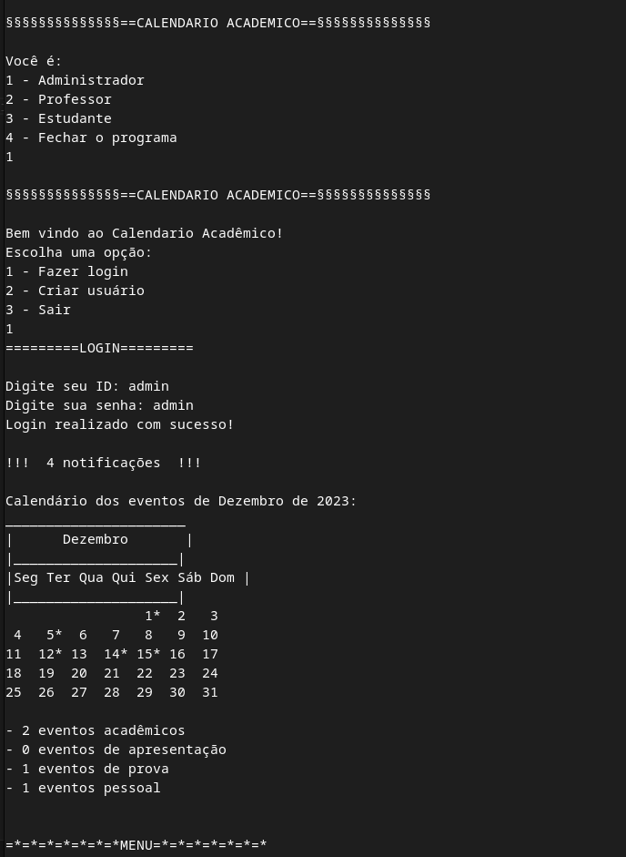
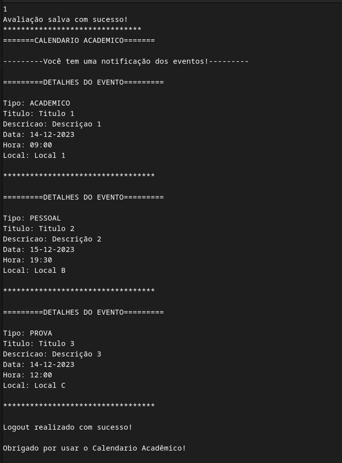

# 20232-team-11
20232-team-11

# Calendário Acadêmico

O **Calendário Acadêmico** é uma plataforma projetada para facilitar a troca de eventos entre administradores, professores e estudantes. Seu objetivo é permitir a gestão de eventos acadêmicos, como trabalhos, tarefas, apresentações, além de eventos pessoais. Este programa oferece a capacidade de criar, modificar, excluir eventos, realizar pesquisas por tipo, data, título, listar eventos todos, por usúario e enviar notificações aos usuários no momento apropriado.

## Funcionalidades
   * Funcionalidades de base:
     - Criação do usúario
     - Login
     - Trocar senha caso esquecir
     - Logout
     - Avaliar o programa

   * Funcionalidades principais:
     - Criação de eventos de tipo acadêmicos (prova, trabalho, apresentação) e de tipo pessaois.
     - Edição de eventos.
     - Exclusão de eventos.
     - Listagem de eventos:
        * futuros
        * passados
        * pessoal

     - Pesquisar de eventos:
        * por título
        * por data
        * por tipo

     - Enviar notificações aos usuários no momento adequado dependendo do tipo de usúario e do tipo de evento.

     
     
     

## Manuel Usuario
 * 1- Certifique-se de ter todos os arquivos em um único diretório a partir do qual você executará o programa.
 * 2- No terminal, execute o seginte comando:
      - comando 1: make run
 * 3- Explorar o programa "Calendario Acadêmico".
   
    ## Modo de exibição das notificações:
      * para os usuários do tipo administrador ou professor, as notificações começam três dias, um dia, e uma hora antes do evento independentemente do tipo.
      * para os usúarios do tipo estudante, as notificações variam conforme o tipo de evento:
         - uma semana, três dias, um dia, e uma hora antes para eventos de prova.
         - três dias, um dia, e uma hora antes para eventos de apresentação ou do tipo acadêmico.
         - três dias, um dia, uma hora e quinze minutos antes para eventos de trabalho.

## Autores
 * Biowa C. Fortunat H.
 * Mateus Oliveira
 * Pedro Bandeira

#####